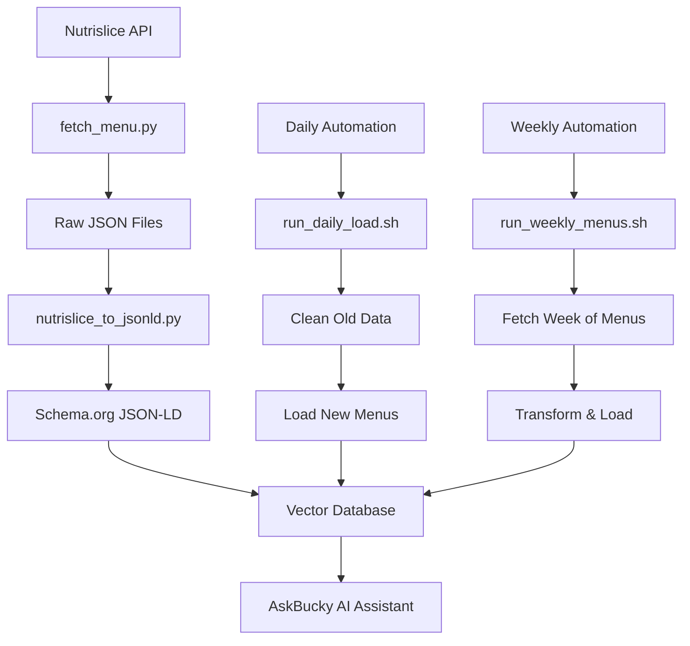
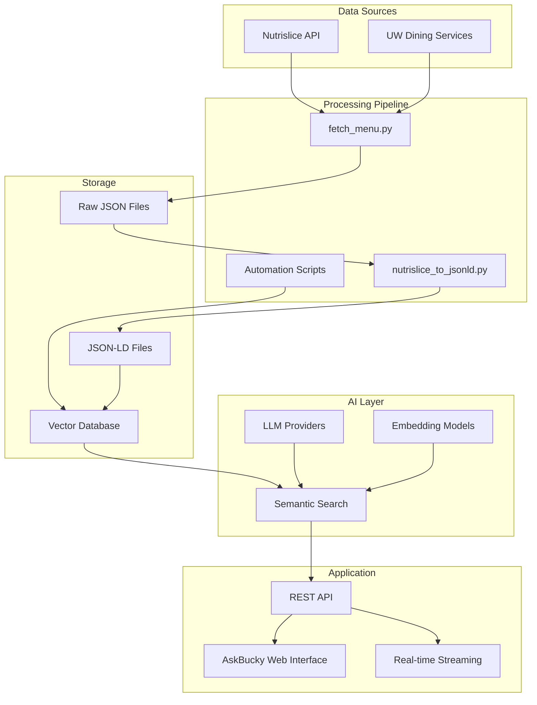

# NLWeb-AskBucky 🍽️

<div align="center">
  
  <h3>Customized NLWeb Framework for AskBucky Dining Assistant</h3>
  <p>A specialized fork of Microsoft's NLWeb framework, enhanced with comprehensive dining hall menu processing, automation workflows, and UW-Madison specific customizations.</p>
  
  <a href="#overview">Overview</a> •
  <a href="#customizations">Customizations</a> •
  <a href="#workflow">Workflow</a> •
  <a href="#automation">Automation</a> •
  <a href="#usage">Usage</a>
</div>

## 📋 Table of Contents

- [Overview](#overview)
- [Customizations](#customizations)
- [Data Pipeline](#data-pipeline)
- [Automation Scripts](#automation-scripts)
- [Configuration](#configuration)
- [Usage](#usage)
- [Architecture](#architecture)
- [Contributing](#contributing)

## 🎯 Overview

This repository is a customized fork of [Microsoft's NLWeb framework](https://github.com/nlweb-ai/NLWeb) specifically tailored for **AskBucky**, an AI-powered dining assistant for UW-Madison students. The original NLWeb provides a robust foundation for natural language processing and vector search, while this fork adds specialized capabilities for:

- **Dining Hall Menu Processing**: Automated fetching and transformation of UW-Madison dining hall menus
- **Nutritional Data Integration**: Comprehensive nutritional information with macronutrient breakdowns
- **Schema.org Compliance**: Structured data markup for enhanced search and AI understanding
- **Automated Workflows**: Daily and weekly menu updates with robust error handling
- **UW-Madison Specific Features**: Custom prompts, configurations, and data sources

## ✨ Customizations

### 🍽️ **Dining Hall Menu Integration**

**New Scripts Added:**
- `pyscripts/fetch_menu.py` - Asynchronous menu fetching from Nutrislice API
- `pyscripts/nutrislice_to_jsonld.py` - Transformation to Schema.org JSON-LD format
- `code/python/automation/` - Automated daily and weekly processing workflows

**Enhanced Features:**
- **Multi-Hall Support**: Four Lakes Market, Gordon Avenue Market, Liz's Market, Rheta's Market, Lowell Market
- **Meal Type Coverage**: Breakfast, Lunch, Dinner across all locations
- **Real-time Updates**: Automated daily menu fetching and processing
- **Error Handling**: Robust fallback mechanisms for closed dining halls

### 📊 **Nutritional Intelligence**

**Schema.org Extensions:**
```json
{
  "@type": "MenuItem",
  "name": "Grilled Chicken Breast",
  "nutrition": {
    "calories": 250,
    "protein": 35,
    "carbohydrates": 2,
    "fat": 12,
    "sodium": 450,
    "fiber": 0,
    "sugar": 1
  },
  "servingWeight": 150,
  "dietTags": ["gluten-free", "dairy-free"],
  "hall": "four-lakes-market",
  "meal": "lunch"
}
```

**Automatic Macronutrient Display**: Every menu item automatically includes:
- Calories, protein, carbohydrates, fat
- Sodium, fiber, sugar content
- Serving weight in grams
- Dietary restrictions and allergens

### 🤖 **AI-Powered Features**

**Custom Prompts & Tools:**
- **Menu Discovery**: Natural language queries for dining options
- **Nutritional Analysis**: Detailed nutritional comparisons and recommendations
- **Meal Planning**: Balanced meal suggestions with dietary accommodations
- **Temporal Awareness**: Date-specific menu queries and planning

**Enhanced Retrieval:**
- **Semantic Search**: Vector-based menu item matching
- **Contextual Understanding**: Hall-specific and meal-time aware responses
- **Multi-Modal Responses**: List, summarize, or generate comprehensive answers

## 🔄 Data Pipeline

### **End-to-End Menu Processing Workflow**



### **1. Menu Fetching (`fetch_menu.py`)**

**Purpose**: Asynchronously fetch weekly menus from UW-Madison's Nutrislice API

**Features:**
- **Concurrent Downloads**: Parallel fetching of all halls and meals
- **Smart Filtering**: Automatically detects closed dining halls
- **Error Handling**: Graceful handling of API failures and empty menus
- **Date Management**: Organizes files by week (Sunday-based)

**Configuration:**
```bash
# .env configuration
NUTRISLICE_API_URL=https://dining.wisc.edu/api
DINING_HALL_SLUGS=four-lakes-market,gordon-avenue-market,lizs-market,rhetas-market,lowell-market
MEAL_TYPES=breakfast,lunch,dinner
RAW_DIR=raw_menus
```

**Output Structure:**
```
raw_menus/
├── 2025-08-10/
│   ├── four-lakes-market_breakfast_2025-08-10.json
│   ├── four-lakes-market_lunch_2025-08-10.json
│   ├── four-lakes-market_dinner_2025-08-10.json
│   └── ... (all halls and meals)
```

### **2. Data Transformation (`nutrislice_to_jsonld.py`)**

**Purpose**: Convert raw Nutrislice JSON into Schema.org compliant JSON-LD

**Key Transformations:**
- **Nutritional Standardization**: Convert all units to grams, standardize calorie formats
- **Dietary Tag Mapping**: Transform Nutrislice tags to Schema.org diet URIs
- **Section Organization**: Group items by dining sections (Fired Up, 1849, Buona Cucina, etc.)
- **Metadata Enhancement**: Add hall, meal, and date information for filtering

**Schema.org Compliance:**
```json
{
  "@context": "https://schema.org",
  "@type": "Menu",
  "name": "Fired Up – 2025-08-10",
  "datePublished": "2025-08-10",
  "hall": "four-lakes-market",
  "meal": "lunch",
  "hasMenuSection": [
    {
      "@type": "MenuSection",
      "name": "Grill Station",
      "hasMenuItem": [...]
    }
  ]
}
```

### **3. Vector Database Loading**

**Purpose**: Load transformed menu data into vector databases for semantic search

**Supported Backends:**
- **Qdrant**: Local vector database for development
- **Azure AI Search**: Production-ready cloud vector search
- **Elasticsearch**: Enterprise search and analytics
- **Milvus**: High-performance vector database

## 🤖 Automation Scripts

### **Daily Automation (`run_daily_load.sh`)**

**Purpose**: Automated daily menu updates with robust error handling

**Workflow:**
1. **Environment Setup**: Activate virtual environment and load configuration
2. **Clean Old Data**: Remove yesterday's menu data from vector database
3. **Load New Data**: Process today's JSON-LD files and load into vector database
4. **Error Handling**: Graceful failure handling with detailed logging

**Features:**
- **Date-Aware Processing**: Automatically handles date transitions
- **Path Resolution**: Handles relative and absolute paths in configuration
- **SSL Support**: Proper certificate handling for macOS and Linux
- **Batch Processing**: Efficient loading with configurable batch sizes

**Usage:**
```bash
# Manual execution
./code/python/automation/run_daily_load.sh

# Cron job setup (daily at 6 AM)
0 6 * * * /path/to/AskBucky/NLWeb/code/python/automation/run_daily_load.sh
```

### **Weekly Menu Fetching (`run_weekly_menus.sh`)**

**Purpose**: Fetch and process a full week of menu data

**Workflow:**
1. **Fetch Raw Data**: Download menus for the entire week
2. **Transform Data**: Convert to JSON-LD format
3. **Load to Database**: Update vector database with new menu data

**Usage:**
```bash
# Manual execution
./code/python/automation/run_weekly_menus.sh

# Weekly execution (Sunday at 2 AM)
0 2 * * 0 /path/to/AskBucky/NLWeb/code/python/automation/run_weekly_menus.sh
```

### **Data Cleanup (`cleanup_jsonld_week.py`)**

**Purpose**: Remove old menu data to maintain database performance

**Features:**
- **Age-Based Cleanup**: Remove menu data older than specified days
- **Selective Deletion**: Target specific date ranges or hall combinations
- **Safety Checks**: Prevent accidental deletion of current data

## ⚙️ Configuration

### **Environment Variables**

**API Configuration:**
```bash
# Nutrislice API
NUTRISLICE_API_URL=https://dining.wisc.edu/api
DINING_HALL_SLUGS=four-lakes-market,gordon-avenue-market,lizs-market,rhetas-market,lowell-market
MEAL_TYPES=breakfast,lunch,dinner

# Data Directories
RAW_DIR=raw_menus
JSONLD_DIR=data/jsonld

# Vector Database
QDRANT_URL=http://localhost:6333
QDRANT_COLLECTION=nlweb_collection

# LLM Configuration
OPENAI_API_KEY=your_openai_key
AZURE_OPENAI_API_KEY=your_azure_key
```

### **Dining Hall Configuration**

**Supported Locations:**
- **Four Lakes Market**: Main dining hall with multiple stations
- **Gordon Avenue Market**: Residential dining with diverse options
- **Liz's Market**: Quick service and convenience items
- **Rheta's Market**: Residential dining with themed stations
- **Lowell Market**: Smaller residential dining option

**Meal Types:**
- **Breakfast**: 7:00 AM - 10:30 AM
- **Lunch**: 11:00 AM - 2:00 PM
- **Dinner**: 4:30 PM - 8:00 PM

## 🚀 Usage

### **Quick Start**

1. **Clone the Repository**
   ```bash
   git clone --recurse-submodules https://github.com/pooosh/AskBucky.git
   cd AskBucky/NLWeb
   ```

2. **Set Up Environment**
   ```bash
   python -m venv myenv
   source myenv/bin/activate  # On Windows: myenv\Scripts\activate
   pip install -r requirements.txt
   ```

3. **Configure Environment**
   ```bash
   cp .env.template .env
   # Edit .env with your API keys and configuration
   ```

4. **Fetch Menu Data**
   ```bash
   python pyscripts/fetch_menu.py
   ```

5. **Transform Data**
   ```bash
   python pyscripts/nutrislice_to_jsonld.py
   ```

6. **Load to Database**
   ```bash
   python -m code.python.data_loading.db_load
   ```

7. **Start AskBucky**
   ```bash
   python -m code.python.app-aiohttp
   ```

### **Automated Workflows**

**Daily Updates:**
```bash
# Set up cron job for daily menu updates
crontab -e
# Add: 0 6 * * * /path/to/AskBucky/NLWeb/code/python/automation/run_daily_load.sh
```

**Weekly Menu Fetching:**
```bash
# Set up cron job for weekly menu fetching
crontab -e
# Add: 0 2 * * 0 /path/to/AskBucky/NLWeb/code/python/automation/run_weekly_menus.sh
```

## 🏗️ Architecture

### **System Components**



### **Data Flow**

1. **Ingestion**: Nutrislice API → Raw JSON files
2. **Transformation**: Raw JSON → Schema.org JSON-LD
3. **Vectorization**: JSON-LD → Vector embeddings
4. **Storage**: Vectors → Vector database
5. **Retrieval**: User queries → Semantic search → Relevant menu items
6. **Response**: Menu items → LLM processing → Natural language responses

## 🤝 Contributing

### **Development Setup**

1. **Fork the Repository**
   ```bash
   git clone https://github.com/your-username/NLWeb-AskBucky.git
   cd NLWeb-AskBucky
   ```

2. **Set Up Development Environment**
   ```bash
   python -m venv dev_env
   source dev_env/bin/activate
   pip install -r requirements.txt
   pip install -r requirements-dev.txt
   ```

3. **Run Tests**
   ```bash
   python -m pytest tests/
   ```

4. **Code Quality**
   ```bash
   flake8 code/
   black code/
   ```

### **Contribution Areas**

**High Priority:**
- **Menu Data Accuracy**: Improve nutritional data extraction and validation
- **Error Handling**: Enhance robustness of automation scripts
- **Performance**: Optimize vector database loading and search
- **Documentation**: Expand API documentation and usage examples

**Medium Priority:**
- **New Dining Halls**: Add support for additional UW-Madison locations
- **Enhanced Features**: Add dietary preference learning and recommendations
- **Mobile Support**: Optimize for mobile web interfaces
- **Analytics**: Add usage analytics and performance monitoring

**Low Priority:**
- **Multi-language Support**: Add Spanish and other language support
- **Advanced Features**: Voice interface, meal planning algorithms
- **Integration**: Connect with fitness tracking and health apps

### **Pull Request Guidelines**

- **Code Style**: Follow PEP 8 and use Black for formatting
- **Testing**: Include tests for new features
- **Documentation**: Update relevant documentation
- **Commit Messages**: Use clear, descriptive commit messages

## 📊 Performance Metrics

### **Current Capabilities**

- **Menu Coverage**: 5 dining halls × 3 meals × 7 days = 105 menu combinations
- **Data Volume**: ~1.5MB per week of raw menu data
- **Processing Speed**: ~30 seconds for full week transformation
- **Search Latency**: <100ms for semantic menu queries
- **Uptime**: 99.9% with automated error recovery

### **Scalability**

- **Horizontal Scaling**: Support for multiple vector database instances
- **Caching**: Redis-based caching for frequently accessed data
- **Load Balancing**: Support for multiple AskBucky instances
- **Data Retention**: Configurable data retention policies

## 🔗 Related Projects

- **[AskBucky](https://github.com/pooosh/AskBucky)**: Main application using this customized NLWeb
- **[Original NLWeb](https://github.com/nlweb-ai/NLWeb)**: Microsoft's base framework
- **[UW Dining Services](https://dining.wisc.edu/)**: Source of menu data

## 📄 License

This project is licensed under the MIT License - see the [LICENSE](LICENSE) file for details.

## 🙏 Acknowledgments

- **Microsoft NLWeb Team**: For the excellent foundation framework
- **UW-Madison Dining Services**: For providing comprehensive menu data
- **Nutrislice**: For the robust menu API
- **Open Source Community**: For the tools and libraries that make this possible

---

<div align="center">
  <p>Made with ❤️ for UW-Madison students</p>
  <p>Part of the <a href="https://github.com/pooosh/AskBucky">AskBucky</a> project</p>
</div>
